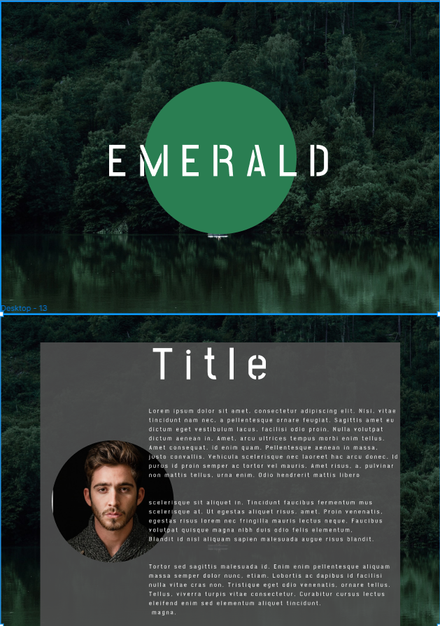

# Emerald pagina web animada
## Inpiracion del proyecto & objetivo

- El objetivo es crear una pagina web animada que me sirva para mejorar mis habilidades de programacion con: CSS para aprednder a usar las animaciones con imagenes SVG.


El diseño web es ha creado en [Figma](https://www.figma.com/file/kP0SJhf4iDDa9kAzsz1LM1/Github-projects?node-id=0%3A1) por Carlos cruz valencia

## Tecnologias usadas
- Ide
    <code></code>

- Programas usados
    <code></code><!-- gitkraken -->
    <code></code>
    
- lenguajes/frameworks usados
    <code></code><!-- css -->
    <code></code><!-- python -->
    <code></code><!-- javascript -->


## Vista previa del proyecto
`` vista no disponible``
<!-- </img> -->
<!-- </img> -->
## Estado del proyecto
|Trabajando en el proyecto|✔️| 
| -------------------------- | :----------------: | 
|            Web responsive  |      ❌        |
|           Hosting          |Github pages    |
| Websever app online        |         ❌    |  
| Dispone de trello          |         ❌    |  
<details >
<summary>⚙️Progreso del proyecto⚙️</summary>

1. Diseño de la pagina web terminado 
    
2. Se crea la animacion del fondo
    

</details>


## Licencia
Este proyecto está bajo la Licencia (MIT) - mira el archivo [LICENSE.md](LICENSE.md)  para mas detalles


<!-- ## !codigo temporal¡
## git update code
```shell
git add -A && git commit -a -m \"update\" && git push
```

## sass compiler code
```shell
sass -w --style compressed assets/styles/sass/main.scss assets/styles/css/main.css
``` -->
